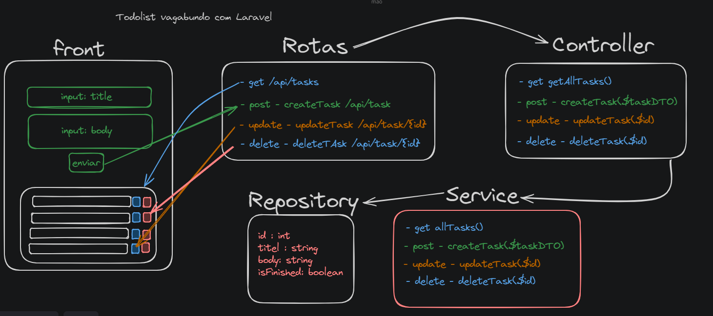

# Todolist com Laravel 😁

O objetivo desse projeto foi criar um CRUD usando laravel.



# Nesse projeto eu entendi como funciona:

-   Models
-   Factorys
-   Controller
-   Validação de request
-   Migrations

# Pastas:

- `Todolist/Task`: É onde se encontra a toda a logica do projeto (service, repository e controller).
- `database/migrations`: Local da tabela da entidade `task`.
- `routes/web.php`: Onde é definida as rotas.

# Instalar Dependências:

```bash
composer install
```

# Migrar o banco de dados:

```bash
php artisan migrate
```

# Rodar o servidor de desenvolvimento:

```bash
php artisan serve
```


